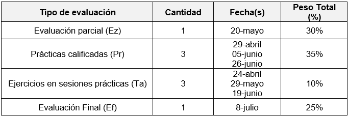

**FACULTAD DE CIENCIAS SOCIALES - PUCP**

Curso: SOC294 - Estadística para el análisis sociológico 2

Semestre 2025-1

```{=html}
<style>
.custom-text {
  color: #00688B;
  font-family: Helvetica, sans-serif;
  text-align: center;
  font-weight: bold;
  font-size: 24 px;
}
</style>
```
::: custom-text
Bienvenidos al curso "Estadística para el Análisis Sociológico 2".
:::

## 1. Sumilla

Es un curso teórico y/o práctico que contribuye al logro de las
competencias de Investigación y Comunicación Eficaz. Busca que los
estudiantes se familiaricen y utilicen las principales técnicas de
análisis cuantitativo multivariable y de construcción de modelos,
identificando su utilidad y pertinencia para diferentes problemas de
investigación. Incluye como temas: regresión múltiple de mínimos
cuadrados y sus supuestos teóricos; modelos de regresión e inferencia
estadística; diagnóstico, especificación e interpretación de modelos de
regresión múltiple; modelos de regresión con variables categóricas;
regresión logística; análisis de componentes principales y análisis
factorial.

## 2. Contenido del curso

Unidad 1: Análisis descriptivo e inferencial.

-   1.1. Fuentes de información secundaria

-   1.2. Análisis descriptivo y ponderación de data

-   1.3. Regresión lineal simple: Estimación y supuestos.

Unidad 2: Modelos de inferencia causal I

-   2.1. Revisión de modelos de inferencia causal

-   2.2. Regresión lineal múltiple: Estimaciones y supuestos

Unidad 3. Modelos de inferencia causal II

-   3.1. Regresión discontinua

-   3.2. Diferencia en diferencias

Unidad 4. Modelos de inferencia causal III

-   4.1. Modelos de efectos fijos

-   4.2. Modelos de efectos aleatorios

## 3. Evaluación



## 5. Ejercicios en sesiones prácticas

Son un total de 3 y constan de ejercicios prácticos breves que se realizarán al final de la
clase.

En 20 minutos, tendrán que resolver **preguntas sobre la temática vista
el mismo día**.

Se tiene permitido el uso de cualquier plataforma de Inteligencia
Artificial (DeepSeek, ChatGPT, Gemini, etc.) durante la prueba.

La calificación va del 0 al 20 en cada prueba.

Fórmula de calificación: (EjePract1 + EjePract2 + EjePract3)/3 = Nota de
Ejercicios en sesiones prácticas

## 6. Prácticas calificadas

Son un total de 3. 

Iniciarán a las 10:05 am hasta las 12:00 pm. 

La calificación va del 0 al 20 en cada práctica.

A través del Paideia, pondrán acceder a la Práctica Calificada y a la data necesaria. Debe ser enviado antes de las 12:00 pm para ser corregido. 

Tema PC1: Regresión lineal simple y múltiple; supuestos de regresión lineal múltiple

Tema PC2: Diferencias en diferencias (DID)

Tema PC3: Diseño de regresión discontinua (RDD)
