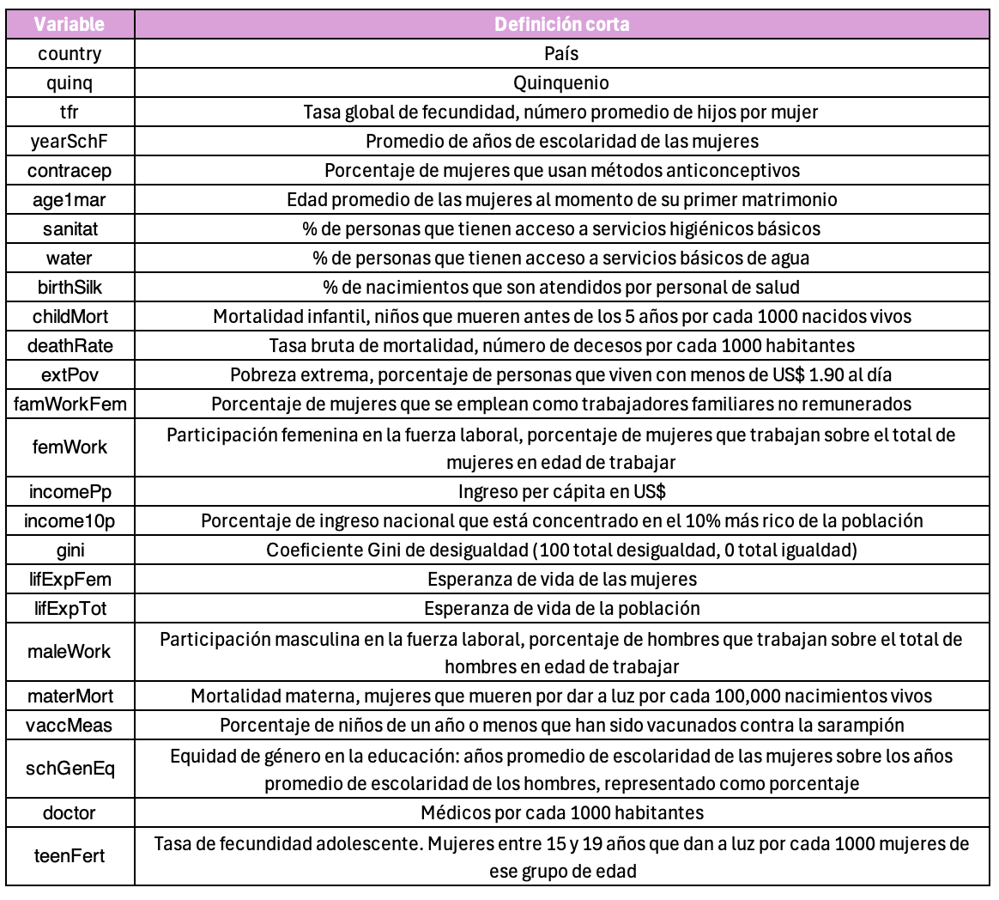

**FACULTAD DE CIENCIAS SOCIALES - PUCP**

Curso: SOC294 - Estadística para el análisis sociológico 2

Semestre 2025 - 1

# **1. Regresión lineal simple**

Técnica estadística que predice el valor de una variable con los valores de otra. La regresión lineal es un método útil para predecir una respuesta cuantitativa Y partiendo de una sola variable predictora X, asumiendo que hay una relación aproximadamente lineal entre X e Y.

Matemáticamente, esta relación lineal se representa como:

*Y = a + bX + E*

Y = variable dependiente o explicada. Variable cuyos valores se desea predecir o resumir. Un modelo de regresión lineal tiene como variable dependiente una variable numérica

a = Constante: valor esperado de “Y” cuando X=0

b = Pendiente: mide el cambio de la variable “Y” por cada unidad de cambio de “X”. Su magnitud sirve para predecir en cuánto aumentará “Y” cada vez que “X” se incremente en una unidad. Su signo puede ser positivo o negativo, representando la dirección del efecto.

X = variable utilizada para predecir el valor de la variable dependiente. También se denomina variable predictora o variable explicativa. Las variables explicativas que son parte del modelo suelen ser numéricas o intervalares; sin embargo, es posible incorporar variables explicativas ordinales o dicotómicas.

E = Corresponde a las desviaciones de los valores verdaderos de Y con respecto a los valores esperados de “Y” (diferencia entre lo observado y estimado por el modelo).

## Evolución de la fecundidad en el mundo: Experanza de vida de las mujeres y tasa global de fecundidad



### **Pasos para la regresión lineal simple**

#### **Paso 1: Analizar la asociación entre las variables de interés**

En el siguiente diagrama de dispersión puede verse la relación entre la fecundidad y la esperanza de vida (2015-2019), donde cada punto representa un país. Como se aprecia, cuantos menos hijos en promedio tienen las mujeres en un país, la esperanza de vida tiende a ser mayor.

```{r}
Sys.setlocale("LC_ALL", "es_ES.UTF-8")
library(dplyr)
library(ggplot2)
load(url("https://www.dropbox.com/s/fyobx9uswy3qgp3/dataWorld_q.rda?dl=1"))

data_1 = dataWorld_q %>% 
  filter(quinq=="2015-2019")

ggplot(data_1, aes(x=tfr, y=lifExpFem)) + geom_point(colour="skyblue") +  xlab("Tasa global de fecundidad, número promedio de hijos por mujer") +  ylab("Esperanza de vida de las mujeres") +  ggtitle ("Relación entre la tasa de fecundidad y la esperanza de vida femenina (2015-2019)") + theme_light()
```

```{r}
#Prueba de correlación
cor.test(data_1$tfr, data_1$lifExpFem)
```


#### **Paso 2: ¿Mi modelo explica una cantidad significativa de variabilidad en la variable dependiente?: TABLA ANOVA**

Para responder a esta pregunta debemos analizar la TABLA DE ANOVA. En esta tabla se analiza el modelo en su conjunto y se realiza una prueba de hipótesis. El estadístico F permite contrastar si existe o no relación significativa entre las variables (¿hay relación lineal?)

Las hipótesis para la prueba F son las siguientes:

H0: El modelo de regresión no es válido

H1: El modelo de regresión es válido (variable X aporta al modelo)

```{r}
modelo1 <- lm(lifExpFem ~ tfr, data=data_1)
anova(modelo1)
```

Pr(\>F) = \< 2.2e-1 → Rechazamos el H0: la tasa de fecundidad influye significativamente en la esperanza de vida de las mujeres.

F-value = 481.02 → Cuanto mayor sea este valor, más fuerte es la relación.

#### **Paso 3: ¿Qué tanto explica mi modelo?/¿Qué tan bien predice? 
##### **Paso 3.1 COEFICIENTE DE DETERMINACIÓN – R2**

Para responder a esta pregunta debemos analizar el R2, más conocido como el Coeficiente de Determinación. El R2 mide la “bondad de ajuste” del modelo de regresión a los datos analizados. Nos indica qué tanto se ajusta la recta de regresión a los valores reales de Y. Podemos interpretarlo como el porcentaje de la variabilidad total de la variable dependiente explicado por la variable independiente.

Los valores van de 0 a 1. Mientras más cercano esté el R2 a 1, mayor será la variabilidad explicada. El R2 es un indicador de ajuste del modelo.

Ejemplo: un R2 de 0.10 explicará un 10% de la variabilidad de Y, podríamos decir que es muy poco. En cambio, un R2 de 0.90 explicará un 90%, por lo que podemos concluir que es un buen modelo.

Problema: R2 siempre aumenta cuando se agregan más variables al modelo, incluso si no son relevantes.

```{r}
summary(modelo1)
```

##### **Paso 3.2 Mean Squared Error (MSE) y Rooted Mean Squared Error (RMSE)**
El MSE mide el promedio de los errores al cuadrar la diferencia entre los valores predichos y los reales. Es decir, muestra cuánto se desvían, en promedio, las predicciones de los valores reales, pero las diferencias se elevan al cuadrado, lo que penaliza los grandes errores.

El RMSE es simplemente la raíz cuadrada del MSE. La razón de usar el RMSE en lugar del MSE es que el RMSE devuelve el error en las mismas unidades que las variables originales, lo cual puede ser más interpretativo que un error en unidades al cuadrado.

MSE siempre es positivo.
Un MSE o RSME bajo indica un modelo con un buen ajuste, mientras que un MSE o RMSE alto sugiere un modelo con un mal ajuste.

```{r}
data_2 = data_1[!is.na(data_1$tfr), ]
modelo2 <- lm(lifExpFem ~ tfr, data=data_2)
predicciones <- predict(modelo2, newdata = data_2)

# Calcular MSE
MSE <- mean((data_2$lifExpFem - predicciones)^2)
MSE

# Calcular RMSE
RMSE <- sqrt(MSE)
RMSE
```
Si la esperanza de vida de las mujeres en tu conjunto de datos varía entre 50 y 90 años (un rango de 40 años), un RMSE de 4.23 años podría considerarse aceptable, ya que es aproximadamente un 10% del rango total de la variable. Si la variabilidad fuera más pequeña, un RMSE tan alto podría indicar que el modelo necesita mejoras.

#### **Paso 4: ¿Cuáles son los parámetros?: TABLA DE COEFICIENTES**

Para responder a esta pregunta debemos analizar la Tabla de Coeficientes. En esta tabla se calculan los coeficientes que irán en la ecuación por cada una de las variables explicativas añadidas en el modelo.

Luego de ello, se realiza una prueba de hipótesis (T) para validar nuestros coeficientes (al igual que validamos anteriormente el modelo en su conjunto). Esta prueba nos permitirá saber si estos coeficientes entran o no en la ecuación final.

Las hipótesis para la prueba T es la siguiente:

H0: La variable X1 no aporta al modelo propuesto (b igual a 0) H1: La variable X1 aporta al modelo propuesto (b diferente de 0)

El valor Pr(\>\|t\|) en un modelo de regresión lineal se refiere al p-valor asociado a la prueba t de cada uno de los coeficientes del modelo.

El Pr(\>\|t\|) te ayuda a decidir si una variable debe ser incluida en el modelo o si su contribución no es lo suficientemente importante

```{r}
summary(modelo1)
```

#### **Paso 5: Construir la ecuación y predecir**

```{r}
modelo1$coefficients
summary(modelo1)
```

Ecuación: lifExpFem= 88.617 − trf(5.185)

Esa ecuación crea una línea recta en el diagrama de dispersión que representa la relación entre ambas vairiables y que representa el cambio esperado en nuestra variable dependiente (esperanza de vida) por cada cambio de una unidad en nuestra variable independiente (fecundidad)

```{r}
ggplot(data_1, aes(x=tfr, y=lifExpFem)) + geom_point(colour="skyblue") +  xlab("Tasa global de fecundidad, número promedio de hijos por mujer") +  ylab("Esperanza de vida de las mujeres") +  ggtitle ("Relación entre la tasa de fecundidad y la esperanza de vida femenina (2015-2019)") + theme_light() + geom_smooth(method=lm,se=F)
```

El error estándar del coeficiente b1 es 0.24. El error estándar del coeficiente es importante porque indica cuánto puede variar un coeficiente estimado si repitieras el análisis con diferentes datos. Un error estándar más pequeño indica una mayor precisión y un modelo más confiable.

La probabilidad (Pr(\>\|t\|)\<2e16) del estadístico de t de Student (-21.93) para la prueba de significancia estadística de este modelo es bastante menor que 0.001. Si consideramos como nivel de significancia para la prueba un nivel máximo de 0.05, podemos rechazar la hipótesis cero. Recordemos que en este caso la hipótesis cero nos dice que el efecto esperado de la nuestra variable dependiente (X) sobre la variable independiente (Y) es igual a cero (0) o nulo. En conclusión, podemos afirmar que la reducción de la fecundidad tiene un efecto estadísticamente significativo en el incremento de la esperanza de vida de las mujeres.

## Evolución de la fecundidad en el mundo: tasa global de fecundidad y educación de las mujeres

La educación de las mujeres es uno de los factores asociados con la reducción de las tasas de fecundidad. Para analizar ese efecto vamos a calcular un modelo de regresión simple donde la variable dependiente es la tasa global de fecundidad y la variable independiente es el promedio de años de escolaridad de las mujeres.

Primero lo haremos para el periodo 1990-1994:

```{r}
ggplot(dataWorld_q[dataWorld_q$quinq=="1990-1994",], aes(x=yearSchF, y=tfr)) +
  geom_point() +  xlab("Años de escolaridad") +  ylab("Número de hijos por mujer") +
  ggtitle("Mundo 1990-94: Tasa de fecundidad según \naños de escolaridad de las mujeres") +
  theme_light()
```

Modelo de regresión:

```{r}
reg_fecund1 <- lm(tfr ~ yearSchF, 
                  data = dataWorld_q[dataWorld_q$quinq=="1990-1994",])

summary(reg_fecund1)
```

## **Comparando modelos para dos periodos**

A continuación calcularemos un modelo de regresión con las mismas variables que el anterior, pero para la década siguiente (periodo 2000-2004). Utilizaremos el paquete stargazer para producir una tabla de resultados que nos permita una mejor presentación de los mismos

La siguiente sintaxis calcula el segundo modelo y produce la tabla con stargazer que nos permite comparar los modelos (los errores estándar de los coeficientes aparecen entre paréntesis)

```{r}
library(stargazer)
reg_fecund2 <- lm(tfr ~ yearSchF, 
                  data = dataWorld_q[dataWorld_q$quinq=="2000-2004",])

stargazer(reg_fecund1, reg_fecund2, type = "text",
          omit.stat=c("ser","f"), 
          column.labels = c("1990-94", "2000-04"),
          star.cutoffs = c(0.05, 0.01, 0.001))
```

## **Predicción vs. Causalidad**

Los modelos de regresión simple (y en general los modelos de regresión) pueden hacer predicciones, pero no necesariamente demuestran causalidad. La regresión describe la relación entre variables, pero para establecer causalidad se requieren condiciones más estrictas, como diseño experimental, control de variables de confusión y análisis más profundos.

¿Por qué la regresión no implica causalidad?: Un modelo de regresión puede mostrar que hay una relación entre dos variables, pero no necesariamente indica que una cause la otra. 

Imagina que quieres estudiar la relación entre el nivel educativo y el salario de las personas. Supongamos que tienes datos que muestran que, en promedio, las personas con mayor nivel educativo ganan más dinero. Pero, esto no implica que el nivel educativo cause el aumento del salario, por varias razones:

1.  Variables de confusión: Factores como la experiencia laboral, el género o la industria en la que trabaja una persona también pueden afectar tanto al salario como al nivel educativo. Si estas variables no se incluyen en el modelo, el resultado podría ser sesgado.

2.  Causalidad inversa: Es posible que las personas con salarios más altos puedan permitirse continuar sus estudios, lo que hace que el nivel educativo sea un efecto de los altos salarios y no una causa.

3.  Causalidad espuria: Tal vez existe una tercera variable (como el acceso a recursos educativos de calidad) que afecta tanto el nivel educativo como el salario.
