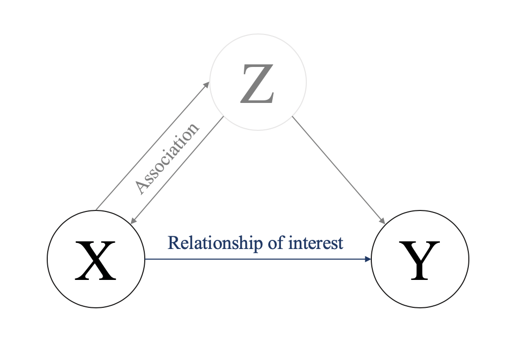
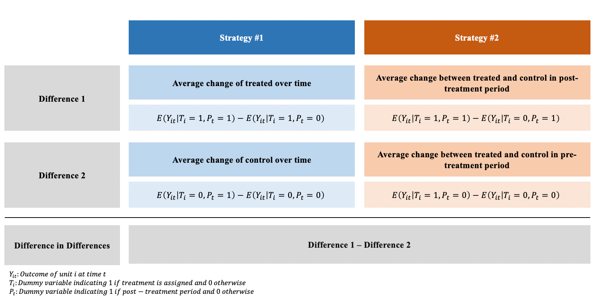
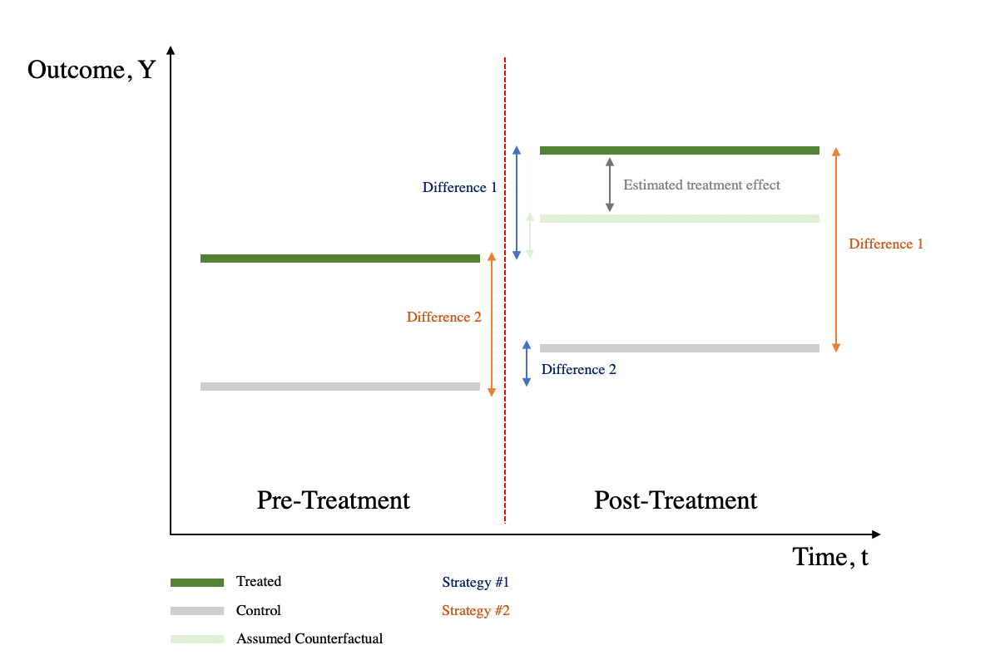
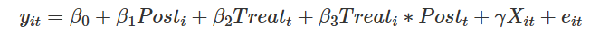
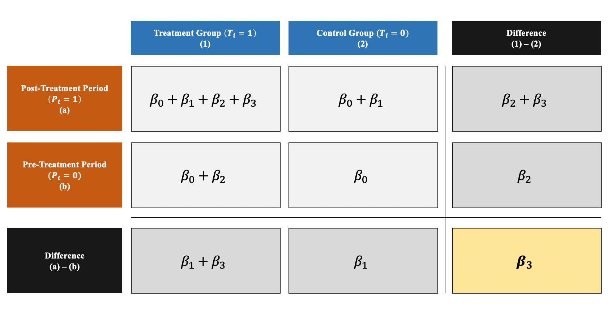
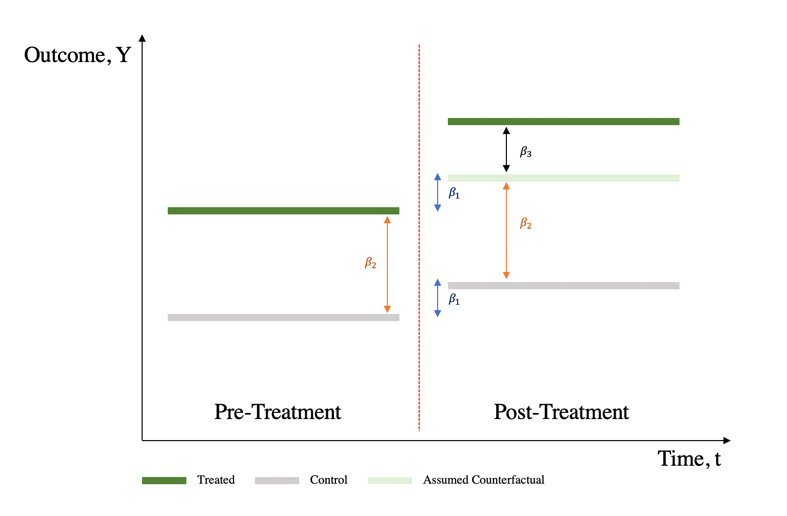

**FACULTAD DE CIENCIAS SOCIALES - PUCP**

Curso: SOC285 - Estadística para el análisis sociológico 2

Semestre 2025 - 1

# Diff-in-Diff (2)

## Recordando brevemente

### Sobre la relación causal:



Ilustración de la vía causal: Z es la causa tanto de X (variable
independiente) como de Y (variable dependiente) y, por tanto, oscurece
la relación entre X e Y.

Dif-in-Dif es una combinación de la diferencia de series temporales
(compara los resultados entre los periodos anterior y posterior al
tratamiento) y la diferencia transversal (compara los resultados entre
los grupos de tratamiento y control):



Visualmente, Diff-in-Diff es la diferencia entre 1) cambios en el
resultado entre pre-tratamiento y post-tratamiento, 2) cambios en el
resultado entre grupo de control y grupo de tratamiento:



### Regresión Diff-in-Diff:



Aunque es posible obtener el estimador DiD calculando las medias a mano,
utilizar un marco de regresión puede resultar más ventajoso, ya que

produce errores estándar para la comprobación de hipótesis

puede ampliarse fácilmente para incluir múltiples periodos y grupos

permite añadir covariables

### Efecto de tratamiento:



-   β0 : Valor medio de ***Y*** en el grupo de control durante el
    preperiodo.

-   β1: Variación media de ***Y*** entre el primer y el segundo periodo
    de tiempo que es común a ambos grupos.

-   β2 : Diferencia media en ***Y*** entre los dos grupos que es común
    en ambos periodos de tiempo.

-   β3 : Cambio diferencial medio en ***Y*** del primer al segundo
    periodo de tiempo del grupo de tratamiento en relación con el grupo
    de control



# Workers' Compensation and Injury Duration: Evidence from a Natural Experiment

Este artículo (Meyer, Viscusi y Durbin: 1995) examina el impacto de las
prestaciones de compensación de los trabajadores en la duración de las
lesiones laborales aprovechando un experimento natural creado por los
aumentos significativos de las cuantías máximas de las prestaciones
semanales en Kentucky y Michigan.

Los autores comparan la duración de las lesiones de las personas con
mayores ingresos, que experimentaron un aumento del 50% en las
prestaciones, con la de las personas con menores ingresos, cuyas
prestaciones se mantuvieron sin cambios.

El estudio concluye que unas prestaciones más elevadas conllevan una
mayor duración de las lesiones, con elasticidades de duración estimadas
en torno a 0,3-0,4. Los resultados sugieren que las prestaciones por
accidentes de trabajo influyen significativamente en las decisiones de
oferta de mano de obra, ya que unas prestaciones más elevadas incentivan
a los trabajadores a prolongar su baja laboral.

```{r}
library(rio)
library(tidyverse)  
library(broom)  
library(scales)  
library(modelsummary)
data=import("INJURY.DTA")
```

## Estadístico descriptivo y visuales

En primer lugar, podemos observar la distribución de las prestaciones de
desempleo entre los que ganan más y los que ganan menos (nuestros grupos
de control y de tratamiento):

```{r}
etiquetas <- c("0" = "Low Earner", "1" = "High Earner")

ggplot(data = data, aes(x = durat)) +
  # binwidth = 8 hace que cada columna represente 2 meses (8 semanas)
  # boundary = 0 hace que la barra 0-8 empiece en 0 y no sea de -4 a 4
  geom_histogram(binwidth = 8, color = "white", boundary = 0) +
  facet_wrap(vars(highearn), labeller = labeller(highearn = etiquetas))+
  labs(x = "Duración en semanas")
```

Si utilizamos el logaritmo de la duración (ldurat), podemos obtener una
distribución menos sesgada que funciona mejor con los modelos de
regresión:

```{r}
ggplot(data = data, mapping = aes(x = ldurat)) +
  geom_histogram(binwidth = 0.5, color = "white", boundary = 0) + 
  facet_wrap(vars(highearn), labeller = labeller(highearn = etiquetas))+
  labs(x = "Duración en semana (logaritmos)")
```

También deberíamos comprobar la distribución del desempleo antes y
después del cambio de política.

```{r}
etiquetas1 <- c("0" = "Antes 1980", "1" = "Después 1980")

ggplot(data = data, mapping = aes(x = ldurat)) +
  geom_histogram(binwidth = 0.5, color = "white", boundary = 0) + 
  facet_wrap(vars(afchnge), labeller = labeller(afchnge = etiquetas1))+
  labs(x = "Duración en semana (logaritmos)")
```

## Diff-in-Diff manual

```{r}
differences <- data %>%
  group_by(afchnge, highearn) %>%
  summarise(mean_ldurat = mean(ldurat))

differences

```

```{r}
# Treatment group (high) before treatment
highb1980 <- differences[1,3]

# Control group (low) before treatment
lowb1980 <- differences[2,3]

# Treatment group (high) after treatment
higha1980 <- differences[3,3]

# Control group (low) after treatment
lowa1980 <- differences[4,3]

Diff=(highb1980-higha1980)-(lowb1980-lowa1980)
Diff
```

La estimación diff-in-diff es de 0,19, lo que significa que el programa
provoca un aumento de la duración del desempleo de 0,19 semanas log. Sin
embargo, las semanas log no tienen sentido, así que tenemos que
interpretarlo con porcentajes.

Recibir el tratamiento (es decir, tener ingresos elevados tras el cambio
de política) provoca un aumento del 19% en la duración del desempleo.

```{r}
before_treatment <- differences %>% 
  filter(afchnge == 0, highearn == 1) %>% 
  pull(mean_ldurat)

before_control <- differences %>% 
  filter(afchnge == 0, highearn == 0) %>% 
  pull(mean_ldurat)

after_treatment <- differences %>% 
  filter(afchnge == 1, highearn == 1) %>% 
  pull(mean_ldurat)

after_control <- differences %>% 
  filter(afchnge == 1, highearn == 0) %>% 
  pull(mean_ldurat)

diff_treatment_before_after <- after_treatment - before_treatment
diff_treatment_before_after

diff_control_before_after <- after_control - before_control
diff_control_before_after

diff_diff <- diff_treatment_before_after - diff_control_before_after

diff_diff
```

Graficar:

```{r}
ggplot(differences, aes(x = as.factor(afchnge), 
                        y = mean_ldurat, 
                        color = as.factor(highearn))) + 
  geom_point() +
  geom_line(aes(group = as.factor(highearn))) +
  annotate(geom = "segment", x = "0", xend = "1",
           y = before_treatment, yend = after_treatment - diff_diff,
           linetype = "dashed", color = "grey50") +
  annotate(geom = "segment", x = "1", xend = "1",
           y = after_treatment, yend = after_treatment - diff_diff,
           linetype = "dotted", color = "blue") +
  annotate(geom = "label", x = "1", y = after_treatment - (diff_diff / 2), 
           label = "Efecto del programa", size = 3) +
  scale_x_discrete(labels = c("0" = "Antes de 1980", "1" = "Después de 1980")) +
  labs(y = "Promedio de duración en semanas (logaritmos)") +
  labs(x = "Aplicación de política") +
  scale_color_discrete(name = "Grupo", labels = c("0" = "Low Earner", "1" = "High Earner"))
```

## Regresión Diff-in-Diff simple

```{r}
modelo_simple <- lm(ldurat ~ highearn + afchnge + highearn * afchnge,
                  data = data)
summary(modelo_simple)
```

## Regresión Diff-in-Diff con variables control

Una ventaja de utilizar la regresión para la diferencia en diferencias
es que podemos incluir variables de control para ayudar a aislar el
efecto. Por ejemplo, puede que los reclamos de los trabajadores de la
construcción o la industria manufacturera tiendan a ser más largos que
los de los trabajadores de otros sectores. O puede que las reclamaciones
por lesiones de espalda tiendan a ser más largas que las reclamaciones
por lesiones de cabeza. También podríamos controlar los datos
demográficos de los trabajadores, como el sexo, el estado civil y la
edad.

```{r}
modelo_variables_cont <- lm(ldurat ~ highearn + afchnge + highearn * afchnge + 
                  male + married + age + hosp + lprewage,
                data = data)

summary(modelo_variables_cont)
```

```{r}
library(stargazer)
stargazer::stargazer(modelo_simple,modelo_variables_cont, type='text')
```
