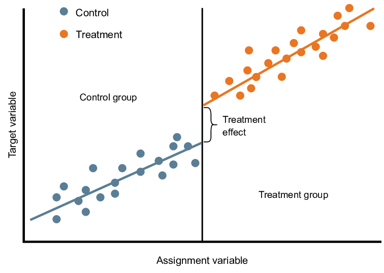

FACULTAD DE CIENCIAS SOCIALES - PUCP

Curso: SOC285 - Estadística para el análisis sociológico 2

Semestre 2025 - 1

# ¿Qué es un Diseño de Regresión Discontinua (RDD)?

El Diseño de Regresión Discontinua (RDD, por sus siglas en inglés) es
una estrategia cuasi-experimental que permite evaluar el impacto causal
de una política o intervención cuando la asignación a un tratamiento se
basa en un umbral en una variable continua. La idea central es que los
individuos justo por encima y por debajo de este umbral son muy
similares en todo, excepto en que unos reciben el tratamiento y otros
no, lo que permite estimar efectos causales de manera robusta, como si
se tratara de un experimento natural.

## ¿Cómo funciona?

El Diseño de Regresión Discontinua (RDD) se basa en la idea de que
cuando una política, programa o tratamiento se asigna en función de un
umbral en una variable continua (llamada **running variable**), los
individuos justo por encima y por debajo de ese umbral son muy
similares, excepto por el hecho de haber recibido o no el tratamiento.
Esto nos permite estimar un efecto causal, como si tuviéramos un
experimento natural.

## Ejemplo

Supongamos que un programa gubernamental otorga becas a estudiantes con
un puntaje de examen mayor o igual a 70. Los estudiantes que obtienen 69
y 70 son muy parecidos en habilidades, pero solo los de 70 reciben la
beca. Comparar el desempeño académico futuro de ambos grupos nos permite
estimar el impacto causal de la beca sobre el rendimiento educativo.



## Regresión

Y𝑖​=α+β𝐷𝑖​+𝑓(𝑋𝑖)+ϵi

Donde:

-   Y𝑖​ ​es la variable de resultado de interés para el individuo 𝑖.

-   α representa el valor esperado de la variable de resultado 𝑌 justo
    por debajo del umbral 𝑐

-   𝐷𝑖​ es la variable indicadora del tratamiento, donde 𝐷𝑖=1 si 𝑋𝑖
    supera el umbral y 𝐷𝑖=0 en caso contrario.

-   𝑋𝑖 es la variable de asignación (o running variable), que determina
    la elegibilidad para el tratamiento.

-   𝑓(𝑋𝑖) es una función flexible de la variable de asignación que
    captura la tendencia de 𝑌𝑖 ​en ausencia del tratamiento (puede ser
    lineal, cuadrática o de orden superior).

-   𝜖𝑖 ​es el término de error.

-   𝛽 es el parámetro clave de interés, que mide el efecto causal del
    tratamiento en el umbral.​

## ¿Por qué es útil para la sociología?

En sociología, el RDD es valioso para evaluar el impacto de políticas
públicas, programas sociales y regulaciones. Por ejemplo, podríamos
analizar cómo una ley que establece un límite de edad para acceder a
beneficios sociales afecta la calidad de vida de los beneficiarios. Al
aprovechar decisiones administrativas que generan discontinuidades, los
sociólogos pueden obtener inferencias causales en contextos donde los
experimentos aleatorizados no son factibles.

## **Tabla de comparaciones RDD y Diff-in-Diff**

|                            |                                                            |                                                |
|:----------------------:|:----------------------:|:----------------------:|
|     **Característica**     |                          **RDD**                           |                **Diff-in-Diff**                |
| Asignación del tratamiento |          Basada en un umbral (variable continua).          |  Basada en grupos (tratamiento vs. control).   |
|       Comparabilidad       |                Individuos cerca del umbral.                |        Grupos con tendencias paralelas.        |
|      Datos necesarios      |      Datos en un punto específico (cerca del umbral).      |    Datos longitudinales (antes y después).     |
|       Ejemplo de uso       | Efecto de becas en estudiantes cerca del puntaje de corte. | Efecto de una política en una región vs. otra. |

# How do extended benefits affect unemployment duration? A regression discontinuity approach.

En esta sesión se replicará el artículo de Rafael Lalive: "How do
extended benefits affect unemployment duration? A regression
discontinuity approach". El autor buscar estudiar el efecto de un
programa que extendió la duración de los beneficios del desempleo de 30
semanas a 209 semanas en Austria. El punto de corte para recibir estos
beneficios era tener al menos 50 años y ser parte de las regiones
elegibles.

De esta forma tenemos 2 umbrales: edad y zona geográfica. El autor
decide quedarse con el segundo umbral como punto de corte porque las
compañías podían esperar a que sus empleados cumplan los 50 años para
darles de baja y así ellos puedan acceder al beneficio. En cambio, la
zona geográfica era un aspecto no manipulable. El autor se enfocará en
los individuos que viven cerca a la frontera entre las regiones tratadas
y no tratadas.

```{r}
library(rio)
library(tidyverse)
data = import('releaseData.dta')
```

## Exploración de datos

### Datos de las personas que pasan el umbral de edad y están en la región tratada.

```{r}
c_1a = data %>% 
  filter(age %in% c(50:53) & female == 0 & period == 1 & tr == 1) %>% 
  summarise(total = n(),
            promedio_edad = mean(age),
            promedio_distancia = mean(db),
            promedio_casado = mean(marr),
            promedio_construccion = mean(bau)) %>% 
  mutate(tipo = "Región tratados 50-53 años",
         sexo = "Hombre")

c_1b = data %>% 
  filter(age %in% c(50:53) & female == 1 & period == 1 & tr == 1) %>% 
  summarise(total = n(),
            promedio_edad = mean(age),
            promedio_distancia = mean(db),
            promedio_casado = mean(marr),
            promedio_construccion = mean(bau))%>% 
  mutate(tipo = "Región tratados 50-53 años",
         sexo = "Mujer")
```

### Datos de las personas que NO pasan el umbral de edad y están en la región tratada:

```{r}
c_2a= data %>% 
  filter(age %in% c(46:49) & female == 0 & period == 1 & tr == 1) %>% 
  summarise(total = n(),
            promedio_edad = mean(age),
            promedio_distancia = mean(db),
            promedio_casado = mean(marr),
            promedio_construccion = mean(bau))%>% 
  mutate(tipo = "Región tratados 46-49 años",
         sexo = "Hombre")

c_2b=data %>% 
  filter(age %in% c(46:49) & female == 1 & period == 1 & tr == 1) %>% 
  summarise(total = n(),
            promedio_edad = mean(age),
            promedio_distancia = mean(db),
            promedio_casado = mean(marr),
            promedio_construccion = mean(bau))%>% 
  mutate(tipo = "Región tratados 46-49 años",
         sexo = "Mujer")
```

### Datos de las personas que pasan el umbral de edad y NO están en la región tratada:

```{r}
c_3a=data %>% 
  filter(age %in% c(50:53) & female == 0 & period == 1 & tr == 0) %>% 
  summarise(total = n(),
            promedio_edad = mean(age),
            promedio_distancia = mean(db),
            promedio_casado = mean(marr),
            promedio_construccion = mean(bau))%>% 
  mutate(tipo = "Región NO tratados 50-53 años",
         sexo = "Hombre")

c_3b =data %>% 
  filter(age %in% c(50:53) & female == 1 & period == 1 & tr == 0) %>% 
  summarise(total = n(),
            promedio_edad = mean(age),
            promedio_distancia = mean(db),
            promedio_casado = mean(marr),
            promedio_construccion = mean(bau))%>% 
  mutate(tipo = "Región NO tratados 50-53 años",
         sexo = "Mujer")
```

### Unión de los descriptivos:

```{r}
rbind(c_1a,c_1b,c_2a,c_2b,c_3a,c_3b) %>% 
  gather(parametro,valor,-c("sexo","tipo")) %>% 
  arrange(sexo) %>% 
  mutate(valor = round(valor,2)) %>% 
  spread(tipo,valor) %>% 
  View()
```

### Promedio de semanas de desempleo entre ambos grupos (46-49 y 50-53) dentro de la región tratada en un gráfico:

#### Hombres:

```{r}
toPlot1 = data %>%
  filter(female == 0 & tr == 1) %>%
  mutate(color_age = ifelse(age>=50,1,0)) %>% 
  group_by(color_age,age) %>% 
  summarise(promedio = mean(unemployment_duration))
  
ggplot(toPlot1, aes(x = age, y = promedio, color =color_age )) +
  geom_line()+
  geom_point()+
  geom_vline(xintercept = 50, colour = "red") + 
  labs(x = "Edad", y = "Semanas de desempleo") + 
  guides(color = FALSE)+
  theme_bw()
```

#### Mujeres:

```{r}
toPlot2 = data %>%
  filter(female == 1 & tr == 1) %>%
  mutate(color_age = ifelse(age>=50,1,0)) %>% 
  group_by(color_age,age) %>% 
  summarise(promedio = mean(unemployment_duration))
  
ggplot(toPlot2, aes(x = age, y = promedio, color =color_age )) +
  geom_line()+
  geom_point()+
  geom_vline(xintercept = 50, colour = "red") + 
  labs(x = "Edad", y = "Semanas de desempleo") + 
  guides(color = FALSE)+
  theme_bw()
```

#### Comparación entre región control y no control por sexo:

```{r}
toPlot3 <- data %>%
  filter(age %in% c(50:53)) %>%  # Filtrar edades entre 50 y 53
  group_by(tr, female, age) %>%  # Agrupar por tr, female y age
  mutate(
    tr = factor(tr, levels = c(0, 1), labels = c("Región no tratada", "Región tratada")),  # Etiquetar tr
    female = factor(female, levels = c(0, 1), labels = c("Hombre", "Mujer"))  # Etiquetar female
  ) %>%
  summarise(promedio = mean(unemployment_duration))  # Calcular el promedio de duración del desempleo

# Crear el gráfico
ggplot(toPlot3, aes(x = age, y = promedio, group = tr, color = tr)) +
  geom_line() +  # Líneas
  geom_point() +  # Puntos
  facet_wrap(~female) +  # Dividir por sexo
  labs(
    x = "Edad", 
    y = "Semanas de desempleo", 
    color = "Región"  # Cambiar el título de la leyenda de color
  ) +
  theme_bw()  # Usar un tema limpio
```

## Modelos de regresión

### Hombres

#### Modelo de regresión - umbral de edad:

```{r}
datos_regresion1 = data %>% 
  filter(female == 0 & period == 1 & tr == 1)

modelo_hombres1 = lm(unemployment_duration ~ as.factor(age50), data = datos_regresion1)

summary(modelo_hombres1)
```

Incrementar los beneficios de desempleo hasta en 209 semanas prolongó la
duración de desempleo en 14.6 semanas en promedio entre hombres de 50 a
53 años comparados a hombres entre 46-49 años de edad.

#### Modelo de regresión - umbral de zona geográfica:

```{r}
datos_regresion2 = data %>% 
  mutate(db_0 = ifelse(db>=0,1,0)) %>% 
  filter(female == 0 & period == 1 & age %in% c(50:53))

modelo_hombres2 = lm(unemployment_duration ~ db_0, data = datos_regresion2)

summary(modelo_hombres2)
```

En las regiones donde se incrementó los beneficios de desempleo hasta en
209 semanas, hubo un aumento promedio de 19.7 semanas de desempleo en
hombres entre 50-53 años de edad.

### Mujeres

#### Modelo de regresión - umbral de edad:

```{r}
# Preparación de datos para RDD
datos_regresion3 <- data %>% 
  filter(female == 1 & period == 1 & tr == 1) %>% 
  mutate(
    # Crear variable de tratamiento (edad >= 50)
    tratamiento = ifelse(age >= 50, 1, 0),
    # Centrar la variable de edad alrededor del punto de corte (50)
    edad_centrada = age - 50
  ) %>% 
  # Filtrar para incluir solo edades cercanas al punto de corte (ventana óptima)
  filter(age %in% 45:55)  # Ajustar este rango según sea necesario

# Modelo de regresión discontinua
modelo_rdd3 <- lm(unemployment_duration ~ tratamiento + edad_centrada + tratamiento:edad_centrada,
                data = datos_regresion3)

# Resumen del modelo
summary(modelo_rdd3)
```
```{r}
# Visualización de la discontinuidad
ggplot(datos_regresion3, aes(x = age, y = unemployment_duration, color = factor(tratamiento))) +
  geom_point(alpha = 0.5) +
  geom_vline(xintercept = 50, linetype = "dashed") +
  geom_smooth(method = "lm", se = FALSE) +
  labs(title = "Regresión Discontinua en Edad = 50",
       x = "Edad",
       y = "Duración del Desempleo",
       color = "Tratamiento (≥50 años)") +
  theme_minimal()
```

Incrementar los beneficios de desempleo hasta en 209 semanas prolongó la
duración de desempleo en 68.1 semanas en promedio entre mujeres de 50 a
53 años comparados a mujeres entre 46-49 años de edad.

#### Modelo de rgeresión - umbral de zona geográfica:

```{r}
# Preparar datos 
datos_regresion4 <- data %>% 
  mutate(db_0 = ifelse(db >= 0, 1, 0)) %>% 
  filter(female == 1 & period == 1 & age %in% c(50:53))

# Modelo RDD
modelo_rdd4 <- lm(unemployment_duration ~ db_0 + I(db - 0) + db_0:I(db - 0), 
                 data = datos_regresion4)
summary(modelo_rdd4)
```

En las regiones donde se incrementó los beneficios de desempleo hasta en
209 semanas, hubo un aumento promedio de 81.7 semanas de desempleo en
mujeres entre 50-53 años de edad.

```{r}
# Gráfico de discontinuidad
ggplot(datos_regresion4, aes(x = db, y = unemployment_duration, color = factor(db_0))) +
  geom_point(alpha = 0.5) +
  geom_smooth(method = "lm", se = FALSE) +
  geom_vline(xintercept = 0, linetype = "dashed") +
  labs(title = "Regresión Discontinua en db = 0", 
       x = "Variable de asignación (db)", 
       y = "Duración del desempleo")
```

