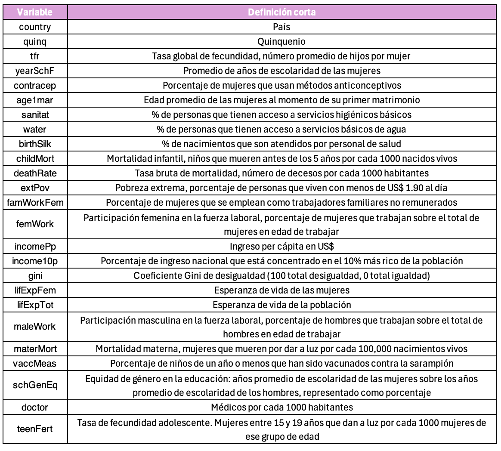

FACULTAD DE CIENCIAS SOCIALES - PUCP

Curso: SOC285 - Estadística para el análisis sociológico 2

Semestre 2025 - 1

Qué es un Diseño de Regresión Discontinua (RDD)

El Diseño de Regresión Discontinua (RDD, por sus siglas en inglés) es
una estrategia cuasi-experimental que permite evaluar el impacto causal
de una política o intervención cuando la asignación a un tratamiento se
basa en un umbral en una variable continua. La idea central es que los
individuos justo por encima y por debajo de este umbral son muy
similares en todo, excepto en que unos reciben el tratamiento y otros
no, lo que permite estimar efectos causales de manera robusta, como si
se tratara de un experimento natural.

¿Cómo funciona?

El Diseño de Regresión Discontinua (RDD) se basa en la idea de que
cuando una política, programa o tratamiento se asigna en función de un
umbral en una variable continua (llamada running variable), los
individuos justo por encima y por debajo de ese umbral son muy
similares, excepto por el hecho de haber recibido o no el tratamiento.
Esto nos permite estimar un efecto causal, como si tuviéramos un
experimento natural.

Ejemplo

Supongamos que un programa gubernamental otorga becas aestudiantes con
un puntaje de examen mayor o igual a 70. Los estudiantes que obtienen 69
y 70 son muy parecidos en habilidades, pero solo los de 70 reciben la
beca. Comparar el desempeño académico futuro de ambos grupos nos permite
estimar el impacto causal de la beca sobre el rendimiento educativo.

Regresión

Y𝑖​=α+β𝐷𝑖​+𝑓(𝑋𝑖)+ϵi

Donde:

-   Y𝑖​ ​es la variable de resultado de interés para el individuo 𝑖.

-   α representa el valor esperado de la variable de resultado 𝑌 justo
    por debajo del umbral 𝑐

-   𝐷𝑖​ es la variable indicadora del tratamiento, donde 𝐷𝑖=1 si 𝑋𝑖
    supera el umbral y 𝐷𝑖=0 en caso contrario.

-   𝑋𝑖 es la variable de asignación (o running variable), que determina
    la elegibilidad para el tratamiento.

-   𝑓(𝑋𝑖) es una función flexible de la variable de asignación que
    captura la tendencia de 𝑌𝑖 ​en ausencia del tratamiento (puede ser
    lineal, cuadrática o de orden superior).

-   𝜖𝑖 ​es el término de error.

-   𝛽 es el parámetro clave de interés, que mide el efecto causal del
    tratamiento en el umbral.​

¿Por qué es útil para la sociología?

En sociología, el RDD es valioso para evaluar el impacto de políticas
públicas, programas sociales y regulaciones. Por ejemplo, podríamos
analizar cómo una ley que establece un límite de edad para acceder a
beneficios sociales afecta la calidad de vida de los beneficiarios. Al
aprovechar decisiones administrativas que generan discontinuidades, los
sociólogos pueden obtener inferencias causales en contextos donde los
experimentos aleatorizados no son factibles.

