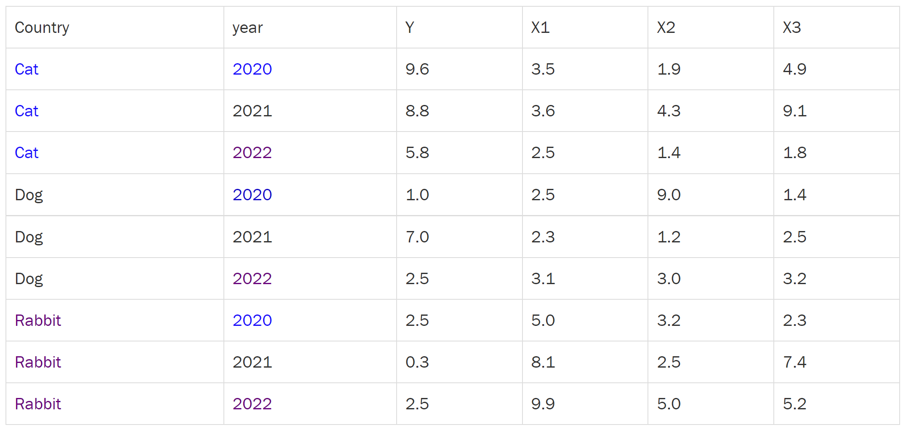

**FACULTAD DE CIENCIAS SOCIALES - PUCP**

Curso: SOC285 - Estadística para el análisis sociológico 2

Semestre 2025 - 1

# Modelo de efectos fijos y aleatorios

En el contexto de los modelos estadísticos para datos panel o
longitudinales (donde se observa a los mismos individuos, grupos o
unidades a lo largo del tiempo), los modelos de efectos fijos (FE) y
efectos aleatorios (RE) son dos enfoques comunes para manejar la
heterogeneidad no observada. Aquí te los explico con definiciones,
ejemplos y diferencias:



## Modelo de Efectos Fijos (FE)

Captura la heterogeneidad no observada entre unidades (individuos,
empresas, países, etc.) asumiendo que cada una tiene un efecto propio
constante en el tiempo (un "efecto fijo"). Estos efectos pueden estar
correlacionados con las variables independientes del modelo. Se estima
eliminando la variación entre unidades (usando transformaciones como
within-estimator o diferencias). Ejemplo: Queremos estudiar cómo el
ingreso (X) afecta la felicidad (Y) en una encuesta a 500 personas
durante 5 años. Un modelo FE controla por características invariantes en
el tiempo de cada persona (ej.: personalidad, habilidades innatas),
asumiendo que estas influyen en Y pero no se observan directamente.

Ecuación básica:

Yit=βXit+αi+ϵit

αi: Efecto fijo de la unidad

ϵit Término de error

## Modelo de Efectos Aleatorios (RE)

Trata la heterogeneidad no observada como una variable aleatoria no
correlacionada con las variables independientes. Asume que los efectos
individuales son independientes de los predictores. Usa tanto la
variación entre unidades como dentro de unidades para estimar los
coeficientes. Ejemplo: En el mismo estudio de ingreso y felicidad, un
modelo RE asume que las diferencias individuales (ej.: personalidad) son
aleatorias y no están relacionadas con el ingreso.

Ecuación básica:

Yit=βXit+ui+ϵit

ui: Efecto aleatorio de la unidad i

## Ejemplo de cada una:

Imagina que eres sociólogo/a y quieres estudiar cómo el desempleo (X)
afecta el bienestar emocional (Y) de las personas. Tienes datos de las
mismas 100 personas entrevistadas durante 3 años.

Aquí hay un problema oculto: cada persona tiene características propias
que afectan su bienestar pero no las estás midiendo, como:

-   Su personalidad (algunas son más resilientes).

-   Su historial familiar (si crecieron en pobreza).

-   Su genética (predisposición a la depresión).

Estas diferencias entre personas se llaman heterogeneidad no observada
(son importantes, pero no las tienes en tus datos). Si no las controlas,
tus resultados estarán sesgados.

¿Cómo solucionarlo?

1.  Modelo de Efectos Fijos (FE)

Qué hace: Asume que cada persona tiene un "efecto único" (constante en
el tiempo) que influye en su bienestar.

Ejemplo: María siempre será más feliz que Pedro (sin importar el
desempleo), por su personalidad optimista.

Cómo lo controla: Compara a cada persona solo consigo misma a lo largo
del tiempo (ignora diferencias entre personas).

Pregunta: "Cuando María se queda sin empleo, ¿cómo cambia su bienestar?"
(no compara a María con Pedro).

Ventaja: Elimina todo lo que no varía en el tiempo (personalidad,
género, raza, etc.), aunque no lo midas.

Limitación: No puedes estudiar variables que no cambian (ej.: "ser
mujer" si nadie cambia de género en tu muestra).

2.  Modelo de Efectos Aleatorios (RE)

Qué hace: Asume que las diferencias entre personas (ej.: personalidad)
son aleatorias y no están relacionadas con las variables del modelo
(ej.: desempleo).

Ejemplo: El optimismo de María no tiene que ver con si pierde o no su
trabajo.

Cómo lo controla: Usa toda la información disponible (diferencias entre
personas + cambios en el tiempo).

Ventaja: Es más eficiente (aprovecha mejor los datos) y permite incluir
variables que no cambian (ej.: sexo, etnia).

Riesgo: Si el supuesto falla (ej.: las personas optimistas pierden menos
empleo), los resultados estarán sesgados.

## ¿Efectos Fijos o Aleatorios? Un Resumen Clave

🔹 Usa Efectos Fijos (FE) cuando: Las diferencias no observadas entre
unidades (personas, ciudades, etc.) pueden estar relacionadas con tu
variable independiente (X).

Ejemplo: Si estudias el impacto del salario (X) en la felicidad (Y) y
sospechas que la personalidad (no medida) afecta tanto al salario como a
la felicidad.

Te interesa analizar solo los cambios dentro de cada unidad a lo largo
del tiempo (no las diferencias entre unidades).

Ejemplo: Quieres saber cómo afecta a una ciudad específica aumentar el
gasto en educación (X) en sus resultados escolares (Y).

Tienes variables invariantes en el tiempo (ej.: género, raza) pero no
son tu foco. (FE las elimina automáticamente).

🔹 Usa Efectos Aleatorios (RE) cuando: Las diferencias no observadas son
independientes de tus variables explicativas (X).

Ejemplo: Comparar cómo el PIB (X) afecta la pobreza (Y) entre países,
incluyendo características fijas como "continente".

Necesitas incluir variables que no cambian en el tiempo (ej.: sexo,
ubicación geográfica).

## Ecuación del modelo de efectos fijos

-   Yit=αi+βXit+ui+eit

-   Yit = Variable dependiente (para la unidad i en el tiempo t)

-   αi = Intercepto para la unidad i

-   β = coeficiente de la variable independiente

-   Xit = Variable independiente (para la unidad i en el tiempo t)

-   ui= error dentro de la unidad i

-   eit = error total

Cuando la variable independiente cambia en 1 unidad en el tiempo, la
variable dependiente se incremente en β unidades. β representa el efecto
común a lo largo de las observaciones controlado por la heterogeneidad
individual.

## Datos: Environment Social and Governance (ESG)

En esta clase trabajaremos con la datos de Environment Social and
Governance (ESG) del Banco mundial. Pueden encontrar más información en
este link
[https://databank.worldbank.org/source/environment-social-and-governance-(esg)-data](https://databank.worldbank.org/source/environment-social-and-governance-(esg)-data){.uri}

```{r}
library(rio)
library(tidyverse)
library(plm)
```

```{r}
dataBM = import("data_EF.xlsx")
```

```{r}
head(dataBM)
```

```{r}
str(dataBM)
```

Lo primero que encontramos es que tenemos varios valores perdidos.
Contemos el número de NAs por columna:

```{r}
NAcount = colSums(is.na(dataBM))
NAcount
```

En uso de combustribles fosiles es donde más NAs tenemos, 295 en total.
¿Cómo lidiamos con este problema? Para tener una data panel balanceada
debemos contar con valores en todas nuestras observaciones y para cada
ola.

Eliminar filas que contienen NAs

```{r}
data_limpia = na.omit(dataBM)
```

Algunos países tendrán información en todas las variables y otros solo
en algunas. Nos quedamos con los países que tengan información para los
5 años

```{r}
data_limpia = data_limpia %>% 
  group_by(Country.Name) %>% 
  filter(n()==5) %>%
  ungroup()
```

Volvemos a contar los NAs:

```{r}
NAcount = colSums(is.na(data_limpia))
NAcount
```

```{r}
table(data_limpia$Year)
```

La tendencia en promedio de la emisión de CO2 en los periodos de nuestra
muestra:

```{r}
toPlot = data_limpia %>% 
  group_by(Year) %>% 
  summarise(CO2_emissions = mean(CO2_emissions)) %>% 
  ungroup()

ggplot(toPlot,aes(x = as.numeric(Year), y = CO2_emissions, group = 1)) + 
  geom_line(aes(group=1)) +
  geom_point()+
  labs(x = "Año", y = "Emisión de CO2")+
  theme_bw()
```

# Modelo de efectos fijos

## Estimación "within"

En esta estimación se está calculando la media dentro de cada país. Cada
caso está siendo comparando consigo mismo en los diferentes años.

```{r}
ml_ef = plm(CO2_emissions~ uso_combustibles_fosiles + porc_agricultural_land + porc_gdp_growth + fertility_rate,
                    data = data_limpia,
                    index = c("Country.Name", "Year"), 
                    model = "within")
```

```{r}
summary(ml_ef)
```

## Interpretación del modelo:

-   En el modelo controlado por las características de cada país, se
    estima que por el incremento de 1 unidad en el uso de combustibles
    fosiles, la emisión de CO2 aumenta en 0.06.

-   En el modelo controlado por las características de cada país, se
    estima que por el incremento de 1 unidad en el porcentaje de tierra
    agrícola, la emisión de CO2 aumenta en 0.02.

-   En el modelo controlado por las características de cada país, se
    estima que por el incremento de 1 unidad en el porcentaje de
    crecimiento del PBI, la emisión de CO2 aumenta en 0.01.

-   En el modelo controlado por las características de cada país, se
    estima que por el incremento de 1 unidad en la tasa de fertilidad,
    la emisión de CO2 aumenta en 0.75.

Como podemos ver en los resultados, no contamos con el valor del
intercepto porque cada país tiene su propio intercepto.

Podemos replicar este mismo análisis usando la función de lm y agregando
la variable de país como factor:

```{r}
ml_ef_ols = lm(CO2_emissions~ uso_combustibles_fosiles + porc_agricultural_land + porc_gdp_growth + fertility_rate + factor(Country.Name),
                    data = data_limpia)

summary(ml_ef_ols)
```

## Errores estándar

Se asume que los errores estándar de cada observación en diferentes
momentos del tiempo son independientes. Es decir, el error estándar de
Perú en el año 2010 es independiente al error estándar de Perú en el año
2011. Este supuesto es muy restrictivo, ya que en un panel se espera que
exista autorrelación en los residuos.

Por ello, debemos considerar que los errores pueden estar
correlacionados dentro de un grupo definido por la unidad de observación
en el que basamos nuestro modelo de efectos fijos.

Para corregir este problema, vamos a calcular los errores estándar
robustos de nuestro modelo:

```{r}
summary(ml_ef,vcov = vcovHC(ml_ef))
```

## ¿Usar el modelo de efectos fijos o el modelo de efectos aleatorios?

En este caso podríamos estar hablando de políticas públicas para la
reducción de emisión de CO2 por ejemplo, lo que puede estar impactando
en el resultado de la variable dependiente.

La prueba de Hausman nos permite comparar el modelo de efectos fijos con
el modelo de efectos aleatorios:

-   H0: Ambos modelos son estadísticamente semejantes

-   H1: Los modelos son estadísticamente diferentes entre sí.

Si se rechaza la H0, se decide quedarse con el modelo de efectos fijos.
Si no se rechaza la H0, el modelo de efectos aleatorios sería el más
eficiente.

### Definimos los modelos

```{r}
modelo_efectos_fijos = plm(CO2_emissions~ uso_combustibles_fosiles + porc_agricultural_land + porc_gdp_growth + fertility_rate,
                    data = data_limpia,
                    index = c("Country.Name", "Year"), 
                    model = "within")

modelo_efectos_aleatorios = plm(CO2_emissions~ uso_combustibles_fosiles + porc_agricultural_land + porc_gdp_growth + fertility_rate,
                    data = data_limpia,
                    index = c("Country.Name", "Year"), 
                    model = "random")
```

### Aplicamos la función de Hausman:

```{r}
phtest(modelo_efectos_fijos, modelo_efectos_aleatorios)
```

Resultado: Se rechaza la hipótesis 0, por lo que nos quedamos con el
modelo de efectos fijos como la mejor representación para explicar la
variable dependiente.
